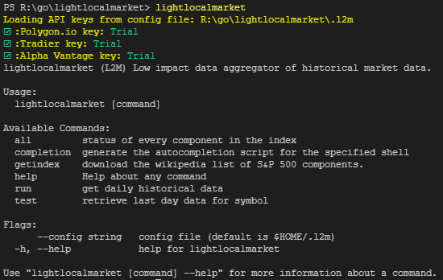
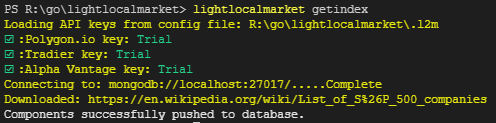
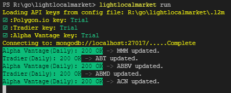
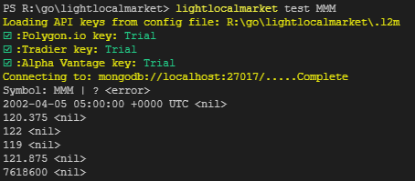
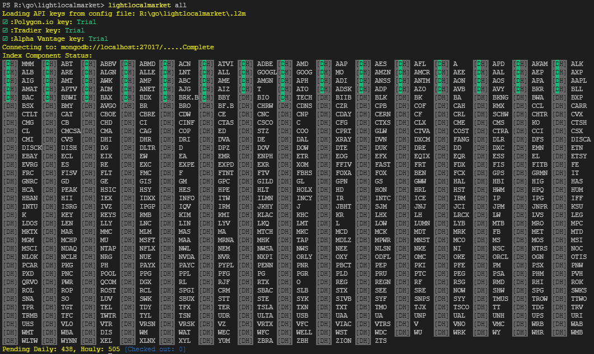
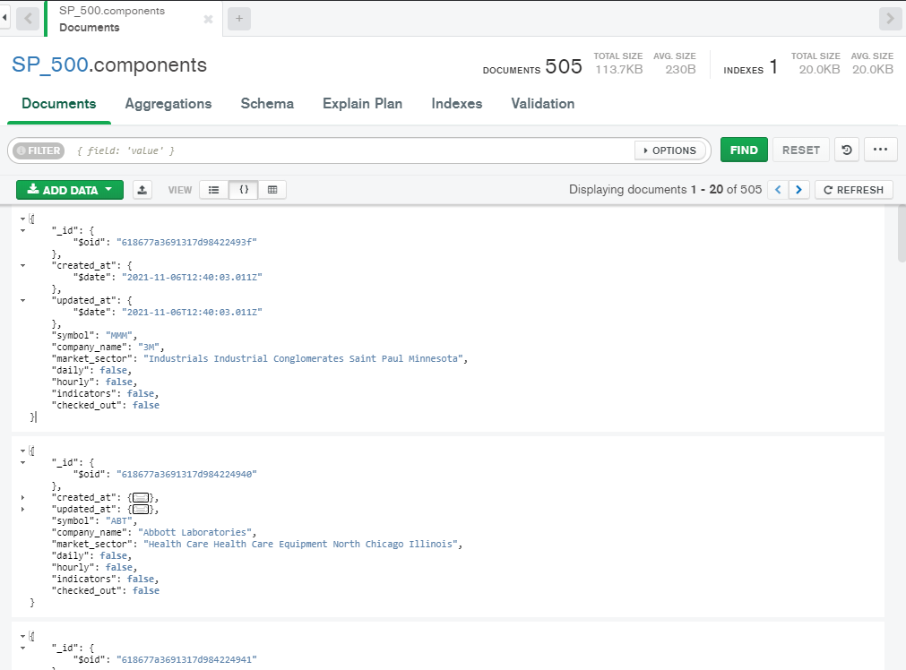
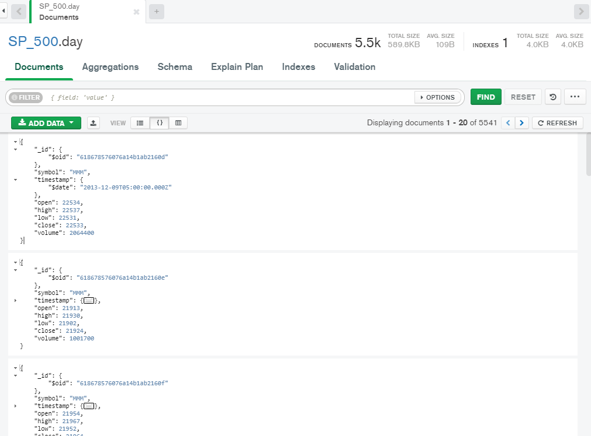

# [lightlocalmarket](https://github.com/plihelix/l2m) - (L2M) Low Impact Local Market Data Aggregation
### *`Intention and Limitations:`*
* This is not intended to compete or subvert paid data by these providers. It is to be a limited dataset for ease of use in development projects or for private studies.
* Will be limited to daily and hourly data on the 505 S&P Components. After the initial fill, updates will be required to occur during off-market hours only.

## Lightlocalmarket automates the aggregation of open-source stock market data into a historical database of daily stock price data for analysis.

A project for IST421-T4.
Currently retrieves ONCE.

* lightlocalmarket - amd64 linux binary executable
* lightlocalmarket.exe - windows binary executable

### Retrieves historical data on 505 components in the S&P 500 daily history for up to 20 years and stores them in a MongoDB.
Stored in 16 bit float for OHLC data and 32 bit integers for the Volume. Later plans to incorperate an option for more traditional 32-bit floats.

Full daily data approximates 250mb stored.
# *`Setup Instructions:`*
## *Required:*
* MongoDB:
	* for local install [mongodb community](https://www.mongodb.com/try/download/community)
	* for free cloud [try mongodb atlas](https://www.mongodb.com/try)

Once setup, the URI address should look something like this: `mongodb://localhost:27017/`
Please place this in the `.l2m` configuration file inside of the quotes for the appropriate items.
* Sign up for API access:
	* [Alpha Vantage](https://www.alphavantage.co/support/#api-key)
	* [Tradier Sandbox](https://developer.tradier.com/user/sign_up)
	* Optional [Polygon.io](https://polygon.io/) *`(Working not yet implemented)`

# *`Using lightlocalmarket:`*
Running `lightlocalmarket` will display the avaiable commands as well as the status of api's in the config file.

*`lightlocalmarket getindex`* to import the current S&P 500 constituents from [Wikipedia](https://en.wikipedia.org/wiki/List_of_S%26P_500_companies)

*`lightlocalmarket run`* to retrieve daily data for the symbols from Alpha Vantage and Tradier.

* The application can be interrupted and will resume if run again.
* Two threads are assigned a portion of the missing list. Because of different complexities in data one may terminate the program early. Simply run again and the remaining will be split again.

Optional: Minimize that console and open another console window.

`lightlocalmarket test [SYMBOL]` will retrieve the last daily data OHLV for the symbol from the database and output it to the console.

`lightlocalmarket all` will list the status of every component in the index.

# *`TARGETS:`*
* collate stock market data from public sources for example uses in statistical analysis, strategy basktesting, and more.
* automatically update mongoDB with historical data for the S&P 500
# *`Data Structure:`*
## SP_500.components

## SP_500.day

*note that MongoDB Compass is not able to display 16 bit floating points correctly.
